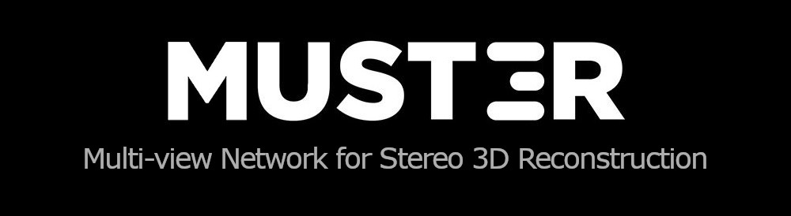
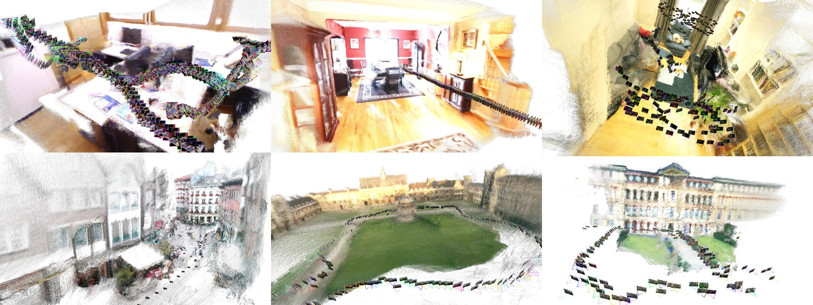
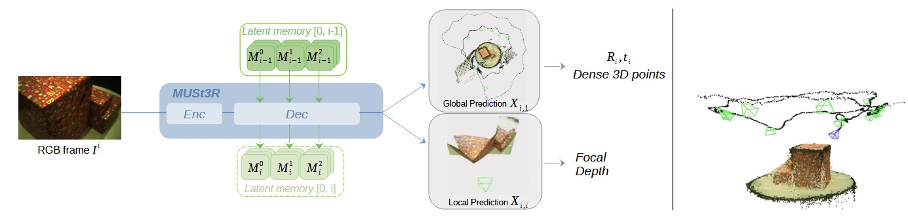

Official implementation of `MUSt3R: Multi-view Network for Stereo 3D Reconstruction`  
[[Project page](https://europe.naverlabs.com/research/publications/must3r-multi-view-network-for-stereo-3d-reconstruction/)], [[MUSt3R arxiv](https://arxiv.org/abs/2503.01661)]  




```bibtex
@inproceedings{must3r_cvpr25,
      title={MUSt3R: Multi-view Network for Stereo 3D Reconstruction}, 
      author={Yohann Cabon and Lucas Stoffl and Leonid Antsfeld and Gabriela Csurka and Boris Chidlovskii and Jerome Revaud and Vincent Leroy},
      booktitle = {CVPR},
      year = {2025}
}

@misc{must3r_arxiv25,
      title={MUSt3R: Multi-view Network for Stereo 3D Reconstruction}, 
      author={Yohann Cabon and Lucas Stoffl and Leonid Antsfeld and Gabriela Csurka and Boris Chidlovskii and Jerome Revaud and Vincent Leroy},
      year={2025},
      eprint={2503.01661},
      archivePrefix={arXiv},
      primaryClass={cs.CV}
}
```


## Table of Contents

- [Table of Contents](#table-of-contents)
- [License](#license)
- [Get Started](#get-started)
  - [Installation](#installation)
  - [Checkpoints](#checkpoints)
- [Demo](#demo)
  - [Offline Gradio (+viser) Demo](#offline-gradio-viser-demo)
  - [Online Visual Odometry Demo (open3d)](#online-visual-odometry-demo-open3d)
- [Training](#training)
  - [Notes](#notes)
  - [Hyperparameters](#hyperparameters)

## License
MUSt3R is released under the MUSt3R Non-Commercial License. See [LICENSE](LICENSE) and [NOTICE](NOTICE) for more information.  
[NOTICE](NOTICE) also contains information about the datasets used to train the checkpoints. The mapfree dataset in particular, which was used to train all models, has a very restrictive license.

## Get Started

MUSt3R extends the DUSt3R architecture through several modifications: making it symmetric and enabling online predictions of the camera pose and 3D structure of a collection of images by using a multi-layer memory mechanism.

### Installation

#### using setup.py
```bash
micromamba create -n must3r python=3.11 cmake=3.14.0
micromamba activate must3r 
pip3 install torch==2.7.0 torchvision==0.22.0 torchaudio==2.7.0 --index-url https://download.pytorch.org/whl/cu126 # use the correct version of cuda for your system

# (recommended) if you can, install xFormers for memory-efficient attention
pip3 install -U xformers==0.0.30 --index-url https://download.pytorch.org/whl/cu126
pip3 install must3r@git+https://github.com/naver/must3r.git
# pip3 install must3r[optional]@git+https://github.com/naver/must3r.git # adds pillow-heif
# pip3 install --no-build-isolation must3r[curope]@git+https://github.com/naver/must3r.git # adds curope
# pip3 install --no-build-isolation must3r[all]@git+https://github.com/naver/must3r.git # adds all optional dependencies
```

#### development (no installation)

```bash
micromamba create -n must3r python=3.11 cmake=3.14.0
micromamba activate must3r 
pip3 install torch==2.7.0 torchvision==0.22.0 torchaudio==2.7.0 --index-url https://download.pytorch.org/whl/cu126 # use the correct version of cuda for your system

# (recommended) if you can, install xFormers for memory-efficient attention
pip3 install -U xformers==0.0.30 --index-url https://download.pytorch.org/whl/cu126

git clone --recursive https://github.com/naver/must3r.git
cd must3r
# if you have already cloned must3r:
# git submodule update --init --recursive

pip install -r dust3r/requirements.txt
pip install -r dust3r/requirements_optional.txt
pip install -r requirements.txt

# install asmk
pip install faiss-cpu  # or the officially supported way (not tested): micromamba install -c pytorch faiss-cpu=1.11.0  # faiss-gpu=1.11.0 
mkdir build
cd build
git clone https://github.com/jenicek/asmk.git
cd asmk/cython/
cythonize *.pyx
cd ..
pip install .
cd ../..

# Optional step: MUST3R relies on RoPE positional embeddings for which you can compile some cuda kernels for faster runtime.
cd dust3r/croco/curope/
pip install .
cd ../../../../
```

### Checkpoints
We provide several pre-trained models. For these checkpoints, make sure to agree to the license of all the training datasets we used, in addition to [MUSt3R License](LICENSE). For more information, check [NOTICE](NOTICE).

| Modelname   | Training resolutions | Head | Encoder | Decoder |
|-------------|----------------------|------|---------|---------|
| [`MUSt3R_224_cvpr.pth`](https://download.europe.naverlabs.com/ComputerVision/MUSt3R/MUSt3R_224_cvpr.pth) | 224x224 | Linear | ViT-L | ViT-B |
| [`MUSt3R_512_cvpr.pth`](https://download.europe.naverlabs.com/ComputerVision/MUSt3R/MUSt3R_512_cvpr.pth)   | 512x384, 512x336, 512x288, 512x256, 512x160 | Linear | ViT-L | ViT-B |
| [`MUSt3R_512.pth`](https://download.europe.naverlabs.com/ComputerVision/MUSt3R/MUSt3R_512.pth) | 512x384, 512x336, 512x288, 512x256, 512x160 | Linear | ViT-L | ViT-B |

`MUSt3R_224_cvpr` and `MUSt3R_512_cvpr` are the same checkpoints that we evaluated for CVPR.  
`MUSt3R_512` was finetuned from `MUSt3R_512_cvpr` with updated hyperparamers (20 views instead of 10, bf16, less token dropout, also see training section) and additional datasets (higher resolution version of [ARKitScenes](https://github.com/apple/ARKitScenes) from the depth upsample subset, updated [ScanNet++](https://kaldir.vc.in.tum.de/scannetpp/) to v2, added back [Virtual Kitti 2](https://europe.naverlabs.com/proxy-virtual-worlds-vkitti-2/), some scenes from [Hypersim](https://github.com/apple/ml-hypersim), and generated scenes with [InfiniGen](https://github.com/princeton-vl/infinigen)). It outperforms `MUSt3R_512_cvpr` in most of the evaluations (see [the updated evaluations](assets/evals.md)).

We also provide both the trainingfree.pth and codebook.pkl files necessary to run image retrieval. `MUSt3R_512_cvpr` and `MUSt3R_512` share the same encoder so there's only one set of files for both of them.  
[`MUSt3R_224_retrieval_trainingfree.pth`](https://download.europe.naverlabs.com/ComputerVision/MUSt3R/MUSt3R_224_retrieval_trainingfree.pth)  
[`MUSt3R_224_retrieval_codebook.pkl`](https://download.europe.naverlabs.com/ComputerVision/MUSt3R/MUSt3R_224_retrieval_codebook.pkl)  

[`MUSt3R_512_retrieval_trainingfree.pth`](https://download.europe.naverlabs.com/ComputerVision/MUSt3R/MUSt3R_512_retrieval_trainingfree.pth)  
[`MUSt3R_512_retrieval_codebook.pkl`](https://download.europe.naverlabs.com/ComputerVision/MUSt3R/MUSt3R_512_retrieval_codebook.pkl)  

```
MD5 checksums (https://download.europe.naverlabs.com/ComputerVision/MUSt3R/checksums.txt):

ac176abd2b2c3bc5f2aea664d82e9ffa  MUSt3R_224_cvpr.pth
2a82597c3317efac40657d4f881c71f0  MUSt3R_224_retrieval_trainingfree.pth
e675ec36c7c40d512ef321fdd289bdbe  MUSt3R_224_retrieval_codebook.pkl

43808705f381a8724aafcd27c88ece35  MUSt3R_512_cvpr.pth
8854f948a8674fb1740258c1872f80dc  MUSt3R_512.pth
f7c133906bcfd4fe6ee157a9ffa85a23  MUSt3R_512_retrieval_trainingfree.pth
1125d80b9de940de2655d19b3ff78bb5  MUSt3R_512_retrieval_codebook.pkl
```

## Demo

### Offline Gradio (+viser) Demo

By default, `demo.py` will open a gradio instance on localhost:7860. If you launch the demo with `--viser`, it will also lauch a viser instance on localhost:8080. Load the images with gradio, hit run and visualize the reconstruction as it's being made in the viser tab.

> [!NOTE]
> `demo.py` is installed as `must3r_demo` (or `must3r_demo.exe`) when must3r is installed to `site-packages`. 

```bash
python demo.py --weights /path/to/MUSt3R_512.pth --retrieval /path/to/MUSt3R_512_retrieval_trainingfree.pth --image_size 512 --viser

# use --amp bf16 if your gpu supports
# Use --local_network to make it accessible on the local network, or --server_name to specify the url manually
# Use --server_port to change the port, by default it will search for an available port starting at 7860
# Use --device to use a different device, by default it's "cuda"
# --viser is used to launch the viser server at the same time as gradio (for real-time updates). You'll need to open a new tab to see this. Note: only instance is launched so it doesn't support multiple instances. It'll launch on port 8080 if available.
# --allow_local_files adds a second tab to load images from a local directory

# other examples
# 512 resolution bf16, allow local files
python demo.py --weights /path/to/MUSt3R_512.pth --retrieval /path/to/MUSt3R_512_retrieval_trainingfree.pth --image_size 512 --amp bf16 --viser --allow_local_files

# 224 resolution, fp16, allow local files
python3 demo.py --weights /path/to/MUSt3R_224_cvpr.pth --retrieval /path/to/MUSt3R_224_retrieval_trainingfree.pth --image_size 224 --viser --allow_local_files --amp fp16
# 768 resolution (will use interpolated positional embeddings)
python demo.py --weights /path/to/MUSt3R_512.pth --retrieval /path/to/MUSt3R_512_retrieval_trainingfree.pth --image_size 768 --amp bf16 --viser
```

> [!Note]
>  IMPORTANT: Explanation of the demo parameters

1) select images:  
     - you can upload images using the gradio.File component.
     - if you use `--allow_local_files`, a second tab will appear: `local_path`. In this tab, you can paste a directory path from your local machine and hit `load` to quickly select all the images inside this directory (not recursive).

2) select global parameters
     - "Number of refinement iterations" increase it to 1 or 2 to do multiple pass on the keyframes (useful for loop closure)  
     - "Maximum batch size" -> If you are using a small gpu or you have a lot of images, put 1 to limit the vram usage (IMPORTANT).  

3) select the inference algorithm:  
  There are 4 Modes implemented. You'll have to select the mode that is most suited to your data:  
> [!Note]
>  If your images are unordered, then you **HAVE TO** select `unordered: retrieval` (only available with the --retrieval option). 

- 3.a. for an unordered collection of images, change it to "unordered: retrieval"  
     - Select the Number of memory images (also called keyframes). For this one, I would say to put as many as possible but to not go above 300, the more images there are, the slower/more memory hungry it'll be.
     - Leave "Render once" toggled OFF. You can toggle it ON if "Number of refinement iterations" > 0. 
- 3.b. for a simple video sequence, you can select "sequence: linspace"
     - Same parameters as 3.a.
- 3.c. for a longer video sequence : "sequence: slam keyframes"  (selected by default).
     - Default parameters should be good enough. You can increase subsample to 4 for slam at higher resolutions (>= 512)
     - The online version is equivalent to "sequence: slam keyframes" with local_context=0.
- 3.d. for a longer video sequence, if the KDTree/slam is too slow for you : "sequence: local context and linspace keyframes".
    - You can also keep default parameters.

4) Hit "Run". Wait for the process the load all images and switch to the viser tab to see the reconstruction, or wait until the full reconstruction appears in gradio.

### Online Visual Odometry Demo (open3d)

> [!NOTE]
> `slam.py` is installed as `must3r_slam` (or `must3r_slam.exe`) when must3r is installed to `site-packages`. 

```bash
# examples
# slam demo from a webcam (512 model)
python slam.py --chkpt /path/to/MUSt3R_512.pth --res 512 --subsamp 4 --gui --input cam:0 

# slam demo from a directory of images (224 model)
python slam.py \
	--chkpt "/path/to/MUSt3R_224_cvpr.pth" \
	--res 224 \
	--subsamp 2 \
  --keyframe_overlap_thr 0.05 \
  --min_conf_keyframe 1.5 \
  --overlap_percentile 85 \
	--input "/path_to/TUM_RGBD/rgbd_dataset_freiburg1_xyz/rgb" \  # can be a folder of video frames, or a webcam: cam:0
	--gui

# slam demo without a gui (it will write final memory state <memory.pkl> and camera trajectory <all_poses.npz>, optionally rerendered with --rerender)
python slam.py --chkpt /path/to/MUSt3R_512.pth --res 512 --subsamp 4 --input /path/to/video.mp4 --output /path/to/export
```

Hit the start toggle on the top right

## Training

### Notes
The training of MUSt3R has evolved since CVPR so I'll write some notes:

- First, MUSt3R is implemented in two different classes: MUSt3R and CausalMUSt3R. MUSt3R is meant for inference and CausalMUSt3R was implemented to speed up the training. Instead of processing images 1 by 1, like at inference, CausalMUSt3R runs blocks of (5) images at once, with a causal attention mask to only attend previous images. The feeback mechanism is only applied after this.

- Two "dropout_mode" are implemented in CausalMUSt3R. "permanent" is the version used for cvpr where memory tokens are permanently removed at every step. "temporary" is the version we've been using since then where tokens are temporarily masked.

- In the dataloader, there are two parameters: min_memory_num_views and max_memory_num_views that didn't exist for the cvpr submissions. They are there to ensure that all images output by the dataloader overlap with at least one of the memory frame (== keyframe). For cvpr, it was possible to select a low number of memory frames, for example 2, and have the 10th image overlap with the 8th but not with any of the first two.

- There's no validation within train.py, you have to run it (eval.py) manually.

### Hyperparameters

Here's an example of training hyperparameters
```python
MKL_NUM_THREADS=1 NUMEXPR_NUM_THREADS=1 OMP_NUM_THREADS=1 PYTHONUNBUFFERED=1 torchrun --nnodes 1 --nproc_per_node 8 --master_port $((RANDOM%500+29000)) train.py --decoder CausalMUSt3R(img_size=(512, 512), feedback_type='single_mlp', memory_mode="kv", mem_dropout=0.1, dropout_mode='temporary', use_xformers_mask=True, use_mem_mask=True) --epochs 100 --warmup_epochs 10 --memory_num_views 20 --memory_batch_views 5 --min_memory_num_views 2 --causal --loss_in_log --amp bf16 --use_memory_efficient_attention --batch_size 1 --accum_iter 4 --dataset "XXX @YOUR_DATASET(ROOT='/pathto/your/dataset', resolution = [(512, 384), (512, 336), (512, 288), (512, 256), (512, 160)], aug_crop=64, num_views=20, min_memory_num_views=2, max_memory_num_views=20, transform=ColorJitter) + ..." --chkpt "/path/to/base_checkpoint" --output_dir "/path/to/output_dir"
```
